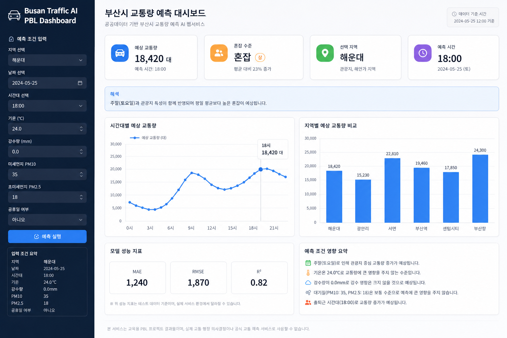
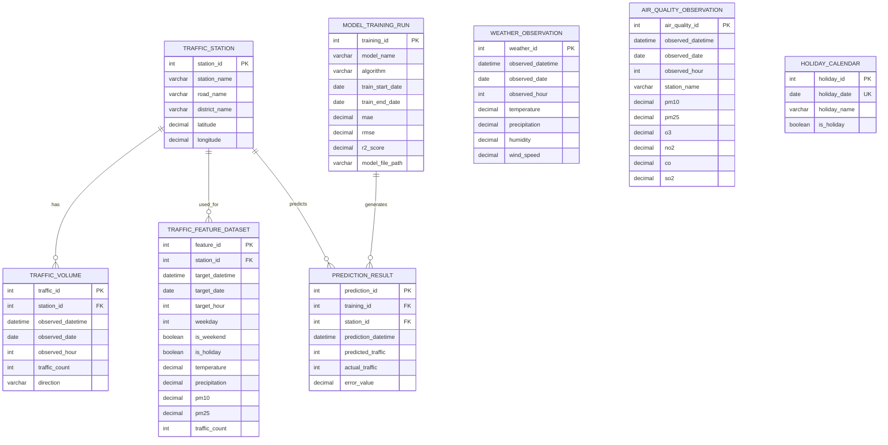

# Busan Traffic AI PBL





## Preview

- [Dynamic Dashboard Preview](docs/preview.html)
- [Streamlit App Source](app/streamlit_app.py)

> `docs/preview.html`은 브라우저에서 바로 열 수 있는 동적 HTML 대시보드 목업입니다.  
> 실제 Streamlit 실행 화면은 `streamlit run app/streamlit_app.py` 실행 후 확인합니다.

공공데이터 기반 **부산시 교통량 예측 AI 웹서비스 개발 PBL 프로젝트**입니다.

이 프로젝트는 **부산의 관광지, 항만, 도심 출퇴근, 행사, 기상 변화 특성을 반영하여 교통량 예측 모델**을 만들고, **Streamlit 기반 웹서비스로 예측 결과를 시각화**합니다.

> 본 프로젝트는 학습 및 포트폴리오 목적의 PBL 프로젝트입니다. 실제 교통 행정 의사결정, 상용 예측 서비스, 공공기관 운영 시스템을 대체하지 않습니다.

---

## 1. Project Overview

**Busan Traffic AI PBL**은 부산시 교통량 데이터를 중심으로 기상, 대기질, 공휴일 여부 등 외부 요인을 결합하여 교통량을 예측하는 AI 웹서비스 프로젝트입니다.

학습자는 프로젝트 수행 과정에서 다음 흐름을 경험합니다.

```text
문제 정의
→ 공공데이터 수집
→ 데이터 전처리
→ 데이터베이스 설계
→ 머신러닝 / 딥러닝 모델 학습
→ 모델 성능 평가
→ 예측 결과 시각화
→ Streamlit 웹서비스 구현
→ PBL 산출물 정리
```

이 프로젝트의 목적은 단순히 모델을 학습시키는 것이 아니라, **공공데이터 기반 문제해결 과정 전체를 PBL 방식으로 수행하는 것**입니다.

---

## 2. Why This Project?

부산은 일반적인 대도시 교통 문제뿐 아니라 지역 특성이 강한 교통 변동 요인을 가지고 있습니다.

| 부산시 특성 | 교통량에 미치는 영향 |
|---|---|
| 해운대·광안리 등 관광지 | 주말, 휴가철, 축제 기간 교통량 증가 |
| 부산항·물류 거점 | 평일 물류 차량 이동량 증가 |
| 서면·부산역 등 도심 | 출퇴근 시간대 혼잡 발생 |
| 센텀시티·벡스코 | 행사일 교통량 급증 가능 |
| 강수·태풍·폭염 등 기상 변화 | 이동량 감소 또는 특정 구간 정체 발생 가능 |
| 공휴일·주말 | 평일과 다른 교통 패턴 발생 |

따라서 부산시 교통량 예측은 단순히 시간대별 평균을 보는 것이 아니라, **지역 특성, 날짜 특성, 기상 조건, 대기질, 공휴일 여부를 함께 고려하는 데이터 기반 예측 문제**로 접근해야 합니다.

---

## 3. Project Goals

- 부산시 교통량 예측 문제를 AI 문제해결 관점에서 정의한다.
- 부산시 교통량, 기온, 강수량, 대기질, 공휴일 데이터를 수집하고 전처리한다.
- 요일, 시간대, 주말 여부, 공휴일 여부 등 파생변수를 생성한다.
- 교통량·기상·대기질·공휴일 데이터를 저장할 수 있는 DB 구조를 설계한다.
- 머신러닝 모델을 활용하여 부산시 교통량을 예측한다.
- PyTorch 기반 MLP 모델을 활용하여 딥러닝 예측 구조를 실습한다.
- 모델 성능을 MAE, RMSE, R² 등 지표로 평가한다.
- Streamlit을 활용하여 예측 결과를 웹서비스 형태로 시각화한다.
- PBL 과정 산출물을 GitHub 포트폴리오로 정리한다.

---

## 4. PBL Learning Flow

이 프로젝트는 PBL 5단계 흐름에 맞춰 진행합니다.

| PBL 단계 | 수행 내용 | 주요 산출물 |
|---|---|---|
| 1. 과제 설정 | 부산시 교통 문제 정의, 사용자 설정 | 문제정의서 |
| 2. 정보수집·계획수립 | 데이터 출처 조사, 변수 선정, 역할분담 | 데이터 조사표, 실행계획서 |
| 3. 계획 확정 | 요구사항 정의, WBS, DB 설계, ERD, 테스트 시나리오 작성 | 요구사항 정의서, WBS, ERD, 테스트 시나리오 |
| 4. 실행 | 데이터 수집, 전처리, 모델 학습, 웹서비스 구현 | 코드, DB 스키마, 모델, Streamlit 앱 |
| 5. 발표·평가 | 결과 발표, 자기평가, 동료평가, KPT 회고 | 발표자료, 회고서, 포트폴리오 |

---

## 5. Service Scenario

사용자는 웹 화면에서 지역, 날짜, 시간대, 날씨 조건 등을 입력하고 예상 교통량 또는 혼잡 수준을 확인할 수 있습니다.

### Example User Flow

```text
지역 선택
→ 날짜 및 시간대 선택
→ 기온·강수량·대기질 조건 입력
→ 예측 실행
→ 예상 교통량 확인
→ 그래프 및 해석 문구 확인
```

### Example Output

```text
예상 교통량: 18,420대
혼잡 수준: 혼잡
해석: 공휴일과 강수 조건이 함께 반영되어 평일 평균보다 높은 혼잡이 예상됩니다.
```

---

## 6. Data Sources

실제 프로젝트에서는 아래 데이터를 수집하여 `data/raw/` 또는 `data/processed/`에 저장합니다.

| 데이터 | 활용 목적 | 예시 컬럼 |
|---|---|---|
| 부산시 교통량 데이터 | 예측 대상값 | 일시, 지점명, 교통량 |
| 부산시 기온 데이터 | 기상 변수 | 일시, 기온 |
| 부산시 강수량 데이터 | 기상 변수 | 일시, 강수량 |
| 부산시 대기오염도 데이터 | 환경 변수 | PM10, PM2.5, O3, NO2 |
| 공휴일 데이터 | 날짜 변수 | 날짜, 공휴일 여부 |
| 파생변수 | 모델 입력 변수 | 요일, 시간대, 주말 여부, 계절 |

### Recommended Final Dataset Columns

```text
datetime
region
traffic_volume
temperature
precipitation
pm10
pm25
o3
no2
weekday
hour
is_weekend
is_holiday
season
```

---

## 7. Tech Stack

| Area | Stack |
|---|---|
| Language | Python |
| Data Processing | Pandas, NumPy |
| Database | MySQL 또는 SQLite |
| Machine Learning | scikit-learn |
| Deep Learning | PyTorch |
| Visualization | Matplotlib, Seaborn, Plotly |
| Web App | Streamlit |
| Collaboration | GitHub, Slack, Padlet |
| Documentation | Markdown, GitHub README |

---

## 8. Main Features

### 8.1 Data Collection

- 공공데이터 API 또는 CSV 기반 데이터 수집
- 교통량, 기상, 대기질, 공휴일 데이터 결합
- 원본 데이터와 전처리 데이터 분리 저장

### 8.2 Data Preprocessing

- 결측치 처리
- 이상치 확인
- 날짜·시간 컬럼 변환
- 요일, 주말 여부, 공휴일 여부 파생변수 생성
- 모델 학습용 데이터셋 생성

### 8.3 Database Design

- 교통량 측정지점, 교통량 관측값, 기상 관측값, 대기질 관측값, 공휴일 정보를 테이블로 분리
- 모델 학습용 통합 피처 데이터셋 관리
- 모델 학습 이력과 예측 결과 저장

### 8.4 Model Training

- 기본 회귀 모델 학습
- 트리 기반 모델 학습
- PyTorch 기반 MLP 모델 실습
- 모델별 성능 비교
- 최종 모델 선정 사유 기록

### 8.5 Model Evaluation

- MAE
- RMSE
- R²
- 실제값과 예측값 비교 그래프
- 모델 한계 분석

### 8.6 Streamlit Web Service

- 지역 선택
- 날짜·시간 조건 입력
- 기온·강수량·대기질 조건 입력
- 예측 결과 출력
- 그래프 시각화
- 해석 문구 제공

---

## 9. Project Structure

```text
busan-traffic-ai-pbl/
├─ README.md
├─ requirements.txt
├─ .env.example
│
├─ data/
│  ├─ raw/
│  │  └─ .gitkeep
│  └─ processed/
│     ├─ merged_x.csv
│     └─ traffic_daily_total_2022_2023.csv
│
├─ notebooks/
│  ├─ 03_busan_baseline_ml.ipynb
│  ├─ 08_busan_weather_api.ipynb
│  ├─ 09_busan_sql_storage.ipynb
│  ├─ 14_busan_air_quality_preprocessing.ipynb
│  ├─ 15_busan_ml_model_training.ipynb
│  ├─ 16_busan_pytorch_mlp.ipynb
│  ├─ 17_busan_hyperparameter_tuning.ipynb
│  ├─ 18_busan_model_visualization.ipynb
│  ├─ 19_busan_model_interpretation.ipynb
│  └─ 20_busan_streamlit_service.ipynb
│
├─ src/
│  ├─ config.py
│  └─ train_model.py
│
├─ app/
│  └─ streamlit_app.py
│
├─ db/
│  ├─ schema.sql
│  ├─ seed.sql
│  └─ README.md
│
├─ docs/
│  ├─ data_sources.md
│  ├─ project_plan.md
│  ├─ wbs.md
│  ├─ erd.md
│  ├─ database-design.md
│  ├─ data-dictionary.md
│  └─ images/
│     └─ busan-traffic-ai-pbl-preview.png
│
├─ models/
│  └─ .gitkeep
│
└─ presentation/
   └─ .gitkeep
```

---

## 10. Work Breakdown Structure, WBS

본 프로젝트는 PBL 과정 산출물을 기준으로 작업을 분해합니다. WBS는 GitHub Issue, Project Board, Sprint 계획과 연결하여 관리합니다.

| WBS ID | 작업명 | 주요 내용 | 담당 역할 | 산출물 |
|---|---|---|---|---|
| 1.0 | 프로젝트 기획 | 문제정의, 사용자 시나리오, 프로젝트 범위 설정 | PM, 전체 팀 | 문제정의서, 기획안 |
| 1.1 | 부산시 교통 문제 정의 | 관광지, 항만, 도심 출퇴근, 기상 변화 요인 분석 | PM, 데이터 담당 | 문제정의서 |
| 1.2 | 데이터 출처 조사 | 교통량, 기온, 강수량, 대기질, 공휴일 데이터 조사 | 데이터 담당 | 데이터 조사표 |
| 1.3 | 요구사항 정의 | 기능 요구사항, 비기능 요구사항, 사용자 요구사항 작성 | PM, 서비스 담당 | 요구사항 정의서 |
| 2.0 | 데이터 수집 | API 또는 CSV 기반 원천 데이터 확보 | 데이터 담당 | 원본 데이터 |
| 2.1 | 교통량 데이터 수집 | 부산시 교통량 데이터 수집 및 저장 | 데이터 담당 | traffic 데이터 |
| 2.2 | 기상 데이터 수집 | 기온, 강수량 데이터 수집 | 데이터 담당 | weather 데이터 |
| 2.3 | 대기질 데이터 수집 | PM10, PM2.5, O3, NO2 데이터 수집 | 데이터 담당 | air quality 데이터 |
| 2.4 | 공휴일 데이터 수집 | 공휴일 여부 데이터 수집 | 데이터 담당 | holiday 데이터 |
| 3.0 | 데이터베이스 설계 | 테이블 구조, ERD, 데이터 사전 작성 | DB 담당 | ERD, schema.sql |
| 3.1 | ERD 작성 | 주요 엔티티와 관계 정의 | DB 담당 | docs/erd.md |
| 3.2 | 스키마 작성 | 테이블, PK, FK, 인덱스 설계 | DB 담당 | db/schema.sql |
| 3.3 | 샘플 데이터 작성 | 테스트용 seed 데이터 작성 | DB 담당 | db/seed.sql |
| 4.0 | 데이터 전처리 | 결측치, 이상치, 인코딩, 파생변수 생성 | 전처리 담당 | 전처리 노트북 |
| 4.1 | 날짜·시간 전처리 | datetime, date, hour, weekday 생성 | 전처리 담당 | processed dataset |
| 4.2 | 결측치·이상치 처리 | 결측값 대체, 이상치 확인 | 전처리 담당 | 전처리 보고서 |
| 4.3 | 피처 엔지니어링 | is_weekend, is_holiday, season 등 생성 | 전처리 담당 | merged_x.csv |
| 5.0 | 모델 학습 | 머신러닝 및 딥러닝 모델 학습 | 모델링 담당 | 학습 코드, 모델 파일 |
| 5.1 | Baseline 모델 | 평균 또는 선형회귀 기반 기준 모델 생성 | 모델링 담당 | baseline 결과 |
| 5.2 | ML 모델 비교 | RandomForest, kNN, tree 기반 모델 비교 | 모델링 담당 | 성능 비교표 |
| 5.3 | PyTorch MLP 실습 | 딥러닝 기반 회귀 모델 학습 | 모델링 담당 | PyTorch 코드 |
| 5.4 | 모델 평가 | MAE, RMSE, R² 기준 평가 | 모델링 담당 | 모델 평가 보고서 |
| 6.0 | 웹서비스 구현 | Streamlit 기반 예측 서비스 개발 | 서비스 담당 | streamlit_app.py |
| 6.1 | 입력 화면 구현 | 지역, 날짜, 시간, 기상 조건 입력 | 서비스 담당 | 입력 UI |
| 6.2 | 예측 결과 화면 구현 | 예측 교통량, 혼잡 수준, 해석 문구 출력 | 서비스 담당 | 결과 UI |
| 6.3 | 시각화 구현 | 실제값·예측값 비교 그래프 구현 | 서비스 담당 | 그래프 화면 |
| 7.0 | 테스트 | 데이터, 모델, 웹서비스 테스트 | 테스트 담당 | 테스트 결과서 |
| 7.1 | 데이터 테스트 | 컬럼 누락, 결측치, 데이터 타입 확인 | 테스트 담당 | 데이터 테스트 결과 |
| 7.2 | 모델 테스트 | 예측 결과 범위, 성능 지표 확인 | 테스트 담당 | 모델 테스트 결과 |
| 7.3 | 웹서비스 테스트 | Streamlit 실행, 입력값 오류, 화면 출력 확인 | 테스트 담당 | 서비스 테스트 결과 |
| 8.0 | 발표·회고 | 최종 발표, KPT 회고, 포트폴리오 정리 | 전체 팀 | 발표자료, 회고서 |

---

## 11. Database Design

이 프로젝트의 DB는 공공데이터 수집값, 모델 학습용 통합 데이터셋, 모델 학습 이력, 예측 결과를 관리하기 위한 학습용 구조입니다.

### 11.1 Core Tables

| Table | Description |
|---|---|
| `traffic_station` | 교통량 측정 지점 정보 |
| `traffic_volume` | 일시·지점별 교통량 관측 데이터 |
| `weather_observation` | 부산시 기온, 강수량, 습도 등 기상 데이터 |
| `air_quality_observation` | PM10, PM2.5, O3, NO2 등 대기질 데이터 |
| `holiday_calendar` | 날짜별 공휴일 여부 |
| `traffic_feature_dataset` | 모델 학습용 통합 피처 데이터 |
| `model_training_run` | 모델 학습 이력과 성능 지표 |
| `prediction_result` | 예측 결과와 실제값 비교 이력 |

### 11.2 Table Summary

#### `traffic_station`

| Column | Type | Description |
|---|---|---|
| `station_id` | INTEGER / BIGINT | 측정 지점 ID, PK |
| `station_name` | VARCHAR | 측정 지점명 |
| `road_name` | VARCHAR | 도로명 |
| `district_name` | VARCHAR | 구·군명 |
| `latitude` | DECIMAL | 위도 |
| `longitude` | DECIMAL | 경도 |

#### `traffic_volume`

| Column | Type | Description |
|---|---|---|
| `traffic_id` | INTEGER / BIGINT | 교통량 데이터 ID, PK |
| `station_id` | INTEGER / BIGINT | 측정 지점 ID, FK |
| `observed_datetime` | DATETIME | 관측 일시 |
| `observed_date` | DATE | 관측 날짜 |
| `observed_hour` | INTEGER | 관측 시간 |
| `traffic_count` | INTEGER | 교통량 |
| `direction` | VARCHAR | 진행 방향 |

#### `weather_observation`

| Column | Type | Description |
|---|---|---|
| `weather_id` | INTEGER / BIGINT | 기상 데이터 ID, PK |
| `observed_datetime` | DATETIME | 관측 일시 |
| `temperature` | DECIMAL | 기온 |
| `precipitation` | DECIMAL | 강수량 |
| `humidity` | DECIMAL | 습도 |
| `wind_speed` | DECIMAL | 풍속 |

#### `air_quality_observation`

| Column | Type | Description |
|---|---|---|
| `air_quality_id` | INTEGER / BIGINT | 대기질 데이터 ID, PK |
| `observed_datetime` | DATETIME | 관측 일시 |
| `station_name` | VARCHAR | 대기질 측정소명 |
| `pm10` | DECIMAL | 미세먼지 |
| `pm25` | DECIMAL | 초미세먼지 |
| `o3` | DECIMAL | 오존 |
| `no2` | DECIMAL | 이산화질소 |
| `co` | DECIMAL | 일산화탄소 |
| `so2` | DECIMAL | 아황산가스 |

#### `holiday_calendar`

| Column | Type | Description |
|---|---|---|
| `holiday_id` | INTEGER / BIGINT | 공휴일 ID, PK |
| `holiday_date` | DATE | 날짜 |
| `holiday_name` | VARCHAR | 공휴일명 |
| `is_holiday` | BOOLEAN / TINYINT | 공휴일 여부 |

#### `traffic_feature_dataset`

| Column | Type | Description |
|---|---|---|
| `feature_id` | INTEGER / BIGINT | 피처 데이터 ID, PK |
| `station_id` | INTEGER / BIGINT | 측정 지점 ID, FK |
| `target_datetime` | DATETIME | 예측 기준 일시 |
| `weekday` | INTEGER | 요일 |
| `is_weekend` | BOOLEAN / TINYINT | 주말 여부 |
| `is_holiday` | BOOLEAN / TINYINT | 공휴일 여부 |
| `temperature` | DECIMAL | 기온 |
| `precipitation` | DECIMAL | 강수량 |
| `pm10` | DECIMAL | 미세먼지 |
| `pm25` | DECIMAL | 초미세먼지 |
| `traffic_count` | INTEGER | 실제 교통량, target |

#### `model_training_run`

| Column | Type | Description |
|---|---|---|
| `training_id` | INTEGER / BIGINT | 학습 실행 ID, PK |
| `model_name` | VARCHAR | 모델명 |
| `algorithm` | VARCHAR | 알고리즘명 |
| `train_start_date` | DATE | 학습 시작 데이터 날짜 |
| `train_end_date` | DATE | 학습 종료 데이터 날짜 |
| `mae` | DECIMAL | MAE |
| `rmse` | DECIMAL | RMSE |
| `r2_score` | DECIMAL | R² |
| `model_file_path` | VARCHAR | 모델 파일 경로 |

#### `prediction_result`

| Column | Type | Description |
|---|---|---|
| `prediction_id` | INTEGER / BIGINT | 예측 결과 ID, PK |
| `training_id` | INTEGER / BIGINT | 학습 실행 ID, FK |
| `station_id` | INTEGER / BIGINT | 측정 지점 ID, FK |
| `prediction_datetime` | DATETIME | 예측 대상 일시 |
| `predicted_traffic` | INTEGER | 예측 교통량 |
| `actual_traffic` | INTEGER | 실제 교통량 |
| `error_value` | DECIMAL | 오차 |

---

## 12. ERD

GitHub README에서는 Mermaid ERD를 통해 DB 관계를 바로 확인할 수 있습니다.



### ERD 설계 기준

- `traffic_station`은 교통량 측정 지점의 기준 테이블입니다.
- `traffic_volume`은 실제 관측된 교통량 데이터를 저장합니다.
- `weather_observation`, `air_quality_observation`, `holiday_calendar`는 시간 또는 날짜 기준으로 결합되는 보조 데이터입니다.
- `traffic_feature_dataset`은 모델 학습을 위해 교통량, 기상, 대기질, 공휴일 여부를 결합한 통합 데이터셋입니다.
- `model_training_run`은 모델 학습 실행 단위와 성능 지표를 저장합니다.
- `prediction_result`는 예측 결과와 실제값 비교 이력을 저장합니다.

---

## 13. Example SQL Schema

정식 스키마는 `db/schema.sql`에 작성합니다. 아래는 핵심 구조 예시입니다.

```sql
CREATE TABLE traffic_station (
    station_id      INTEGER PRIMARY KEY AUTOINCREMENT,
    station_name    VARCHAR(100) NOT NULL,
    road_name       VARCHAR(100),
    district_name   VARCHAR(50),
    latitude        DECIMAL(10, 7),
    longitude       DECIMAL(10, 7),
    created_at      DATETIME DEFAULT CURRENT_TIMESTAMP
);

CREATE TABLE traffic_volume (
    traffic_id          INTEGER PRIMARY KEY AUTOINCREMENT,
    station_id          INTEGER NOT NULL,
    observed_datetime   DATETIME NOT NULL,
    observed_date       DATE NOT NULL,
    observed_hour       INTEGER NOT NULL,
    traffic_count       INTEGER NOT NULL,
    direction           VARCHAR(50),
    created_at          DATETIME DEFAULT CURRENT_TIMESTAMP,
    FOREIGN KEY (station_id) REFERENCES traffic_station(station_id)
);

CREATE TABLE weather_observation (
    weather_id          INTEGER PRIMARY KEY AUTOINCREMENT,
    observed_datetime   DATETIME NOT NULL,
    observed_date       DATE NOT NULL,
    observed_hour       INTEGER NOT NULL,
    temperature         DECIMAL(5, 2),
    precipitation       DECIMAL(6, 2),
    humidity            DECIMAL(5, 2),
    wind_speed          DECIMAL(5, 2),
    created_at          DATETIME DEFAULT CURRENT_TIMESTAMP
);

CREATE TABLE air_quality_observation (
    air_quality_id      INTEGER PRIMARY KEY AUTOINCREMENT,
    observed_datetime   DATETIME NOT NULL,
    observed_date       DATE NOT NULL,
    observed_hour       INTEGER NOT NULL,
    station_name        VARCHAR(100),
    pm10                DECIMAL(6, 2),
    pm25                DECIMAL(6, 2),
    o3                  DECIMAL(6, 4),
    no2                 DECIMAL(6, 4),
    co                  DECIMAL(6, 4),
    so2                 DECIMAL(6, 4),
    created_at          DATETIME DEFAULT CURRENT_TIMESTAMP
);

CREATE TABLE holiday_calendar (
    holiday_id      INTEGER PRIMARY KEY AUTOINCREMENT,
    holiday_date    DATE NOT NULL UNIQUE,
    holiday_name    VARCHAR(100),
    is_holiday      INTEGER NOT NULL DEFAULT 0,
    created_at      DATETIME DEFAULT CURRENT_TIMESTAMP
);

CREATE TABLE traffic_feature_dataset (
    feature_id          INTEGER PRIMARY KEY AUTOINCREMENT,
    station_id          INTEGER NOT NULL,
    target_datetime     DATETIME NOT NULL,
    target_date         DATE NOT NULL,
    target_hour         INTEGER NOT NULL,
    weekday             INTEGER NOT NULL,
    is_weekend          INTEGER NOT NULL,
    is_holiday          INTEGER NOT NULL,
    temperature         DECIMAL(5, 2),
    precipitation       DECIMAL(6, 2),
    pm10                DECIMAL(6, 2),
    pm25                DECIMAL(6, 2),
    traffic_count       INTEGER NOT NULL,
    created_at          DATETIME DEFAULT CURRENT_TIMESTAMP,
    FOREIGN KEY (station_id) REFERENCES traffic_station(station_id)
);

CREATE TABLE model_training_run (
    training_id         INTEGER PRIMARY KEY AUTOINCREMENT,
    model_name          VARCHAR(100) NOT NULL,
    algorithm           VARCHAR(100) NOT NULL,
    train_start_date    DATE,
    train_end_date      DATE,
    mae                 DECIMAL(10, 4),
    rmse                DECIMAL(10, 4),
    r2_score            DECIMAL(10, 4),
    model_file_path     VARCHAR(255),
    created_at          DATETIME DEFAULT CURRENT_TIMESTAMP
);

CREATE TABLE prediction_result (
    prediction_id           INTEGER PRIMARY KEY AUTOINCREMENT,
    training_id             INTEGER NOT NULL,
    station_id              INTEGER NOT NULL,
    prediction_datetime     DATETIME NOT NULL,
    predicted_traffic       INTEGER NOT NULL,
    actual_traffic          INTEGER,
    error_value             DECIMAL(10, 4),
    created_at              DATETIME DEFAULT CURRENT_TIMESTAMP,
    FOREIGN KEY (training_id) REFERENCES model_training_run(training_id),
    FOREIGN KEY (station_id) REFERENCES traffic_station(station_id)
);
```

---

## 14. Quick Start

### 14.1 Install Dependencies

```bash
pip install -r requirements.txt
```

### 14.2 Train Model

```bash
python src/train_model.py
```

### 14.3 Run Streamlit App

```bash
streamlit run app/streamlit_app.py
```

실행 후 브라우저에서 아래 주소로 접속합니다.

```text
http://localhost:8501
```

---

## 15. Environment Variables

API Key 또는 외부 토큰은 코드에 직접 작성하지 않습니다.

`.env.example`을 참고하여 `.env` 파일을 생성합니다.

```bash
cp .env.example .env
```

Example:

```env
KMA_API_KEY=your_kma_api_key
DATA_GO_KR_API_KEY=your_data_go_kr_api_key
DB_HOST=localhost
DB_PORT=3306
DB_NAME=busan_traffic
DB_USER=root
DB_PASSWORD=your_password
```

`.env` 파일은 GitHub에 올리지 않습니다.

---

## 16. Data Files

샘플 실행을 위해 합성 데이터가 포함되어 있습니다.

```text
data/processed/merged_x.csv
data/processed/traffic_daily_total_2022_2023.csv
```

실제 프로젝트에서는 부산시 교통량, 기온, 강수량, 대기질, 공휴일 데이터를 수집한 뒤 위 파일 구조에 맞게 대체합니다.

---

## 17. Model Pipeline

```text
Raw Data
→ Data Cleaning
→ Feature Engineering
→ Database Loading
→ Train/Test Split
→ Model Training
→ Model Evaluation
→ Prediction Result
→ Streamlit Visualization
```

### Feature Examples

| Feature | Description |
|---|---|
| `temperature` | 기온 |
| `precipitation` | 강수량 |
| `pm10` | 미세먼지 |
| `pm25` | 초미세먼지 |
| `is_holiday` | 공휴일 여부 |
| `is_weekend` | 주말 여부 |
| `hour` | 시간대 |
| `weekday` | 요일 |
| `region` | 측정 지역 또는 교통 지점 |

---

## 18. PBL Deliverables

| Category | Deliverable |
|---|---|
| Planning | 문제정의서, 프로젝트 기획안, 팀별 주제 선정표 |
| Data | 데이터 조사표, 데이터 명세서, 원본 데이터, 전처리 데이터 |
| Design | 요구사항 정의서, WBS, 테스트 시나리오, ERD, 화면 설계서 |
| Database | schema.sql, seed.sql, database-design.md, data-dictionary.md |
| Development | 데이터 수집 코드, 전처리 코드, 모델 학습 코드, Streamlit 앱 |
| Evaluation | 모델 성능 비교표, 테스트 결과서, 루브릭 평가표 |
| Presentation | 최종 발표자료, 실행 화면 캡처, 시연 영상 |
| Portfolio | GitHub Repository, README.md, 프로젝트 보고서, KPT 회고서 |

---

## 19. Evaluation Criteria

| Criteria | Description |
|---|---|
| Problem Definition | 부산시 교통 문제를 데이터 기반 예측 문제로 정의했는가 |
| Data Quality | 데이터 출처, 컬럼, 결측치, 이상치 처리 기준이 명확한가 |
| Database Design | 교통량, 기상, 대기질, 공휴일, 예측 결과를 저장할 DB 구조가 적절한가 |
| ERD | 주요 엔티티와 관계를 명확하게 표현했는가 |
| Modeling | 예측 모델을 학습하고 성능을 비교했는가 |
| Visualization | 사용자가 이해할 수 있도록 결과를 시각화했는가 |
| Web Service | Streamlit으로 예측 결과를 서비스 형태로 구현했는가 |
| Collaboration | GitHub Issue, Commit, 역할분담 기록이 남아 있는가 |
| Reflection | KPT 회고를 통해 문제점과 개선 방향을 도출했는가 |

---

## 20. Security Notice

업로드된 원본 노트북에는 API Key 또는 ngrok token이 직접 작성된 셀이 포함되어 있었습니다.

이 프로젝트에서는 해당 값을 제거하고 `.env.example` 구조로 변경했습니다.

### Do Not Commit

```text
.env
*.key
*.pem
API_KEY
ngrok token
개인 인증키
```

실제 키는 `.env` 또는 운영환경의 환경변수로 관리해야 하며, GitHub에 올리면 안 됩니다.

---

## 21. Recommended Repository Name

```text
busan-traffic-ai-pbl
```

---

## 22. Commit Message Examples

```bash
git commit -m "chore: initialize Busan traffic AI PBL project"
git commit -m "docs: update README with preview image"
git commit -m "docs: add WBS and ERD to README"
git commit -m "feat: add database schema for traffic prediction"
git commit -m "feat: add Streamlit traffic prediction app"
git commit -m "feat: add baseline traffic prediction model"
git commit -m "docs: add PBL project deliverables"
```

---

## 23. License

This project is for educational and portfolio purposes.

The prediction results are based on sample data or public data preprocessing and should not be interpreted as official traffic forecasts.
