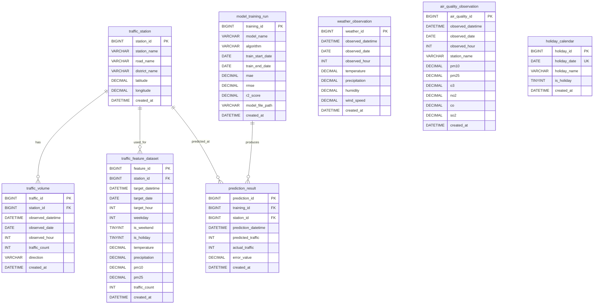

# ERD

```mermaid
erDiagram
    traffic_station ||--o{ traffic_volume : has
    traffic_station ||--o{ traffic_feature_dataset : used_for
    traffic_station ||--o{ prediction_result : predicted_at
    model_training_run ||--o{ prediction_result : produces

    traffic_station {
        BIGINT station_id PK
        VARCHAR station_name
        VARCHAR road_name
        VARCHAR district_name
        DECIMAL latitude
        DECIMAL longitude
        DATETIME created_at
    }

    traffic_volume {
        BIGINT traffic_id PK
        BIGINT station_id FK
        DATETIME observed_datetime
        DATE observed_date
        INT observed_hour
        INT traffic_count
        VARCHAR direction
        DATETIME created_at
    }

    weather_observation {
        BIGINT weather_id PK
        DATETIME observed_datetime
        DATE observed_date
        INT observed_hour
        DECIMAL temperature
        DECIMAL precipitation
        DECIMAL humidity
        DECIMAL wind_speed
        DATETIME created_at
    }

    air_quality_observation {
        BIGINT air_quality_id PK
        DATETIME observed_datetime
        DATE observed_date
        INT observed_hour
        VARCHAR station_name
        DECIMAL pm10
        DECIMAL pm25
        DECIMAL o3
        DECIMAL no2
        DECIMAL co
        DECIMAL so2
        DATETIME created_at
    }

    holiday_calendar {
        BIGINT holiday_id PK
        DATE holiday_date UK
        VARCHAR holiday_name
        TINYINT is_holiday
        DATETIME created_at
    }

    traffic_feature_dataset {
        BIGINT feature_id PK
        BIGINT station_id FK
        DATETIME target_datetime
        DATE target_date
        INT target_hour
        INT weekday
        TINYINT is_weekend
        TINYINT is_holiday
        DECIMAL temperature
        DECIMAL precipitation
        DECIMAL pm10
        DECIMAL pm25
        INT traffic_count
        DATETIME created_at
    }

    model_training_run {
        BIGINT training_id PK
        VARCHAR model_name
        VARCHAR algorithm
        DATE train_start_date
        DATE train_end_date
        DECIMAL mae
        DECIMAL rmse
        DECIMAL r2_score
        VARCHAR model_file_path
        DATETIME created_at
    }

    prediction_result {
        BIGINT prediction_id PK
        BIGINT training_id FK
        BIGINT station_id FK
        DATETIME prediction_datetime
        INT predicted_traffic
        INT actual_traffic
        DECIMAL error_value
        DATETIME created_at
    }
```
